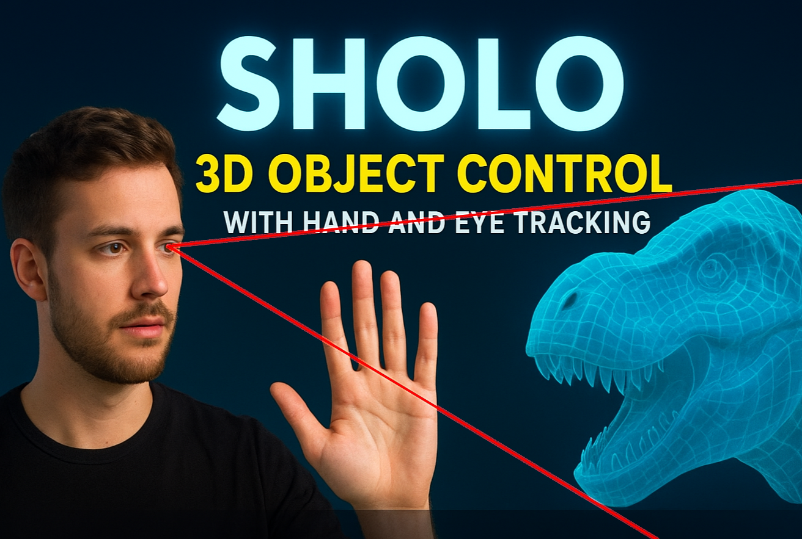

# SHolo: 3D Object Control with Hand and Eye Tracking

This project is an augmented reality application that allows a user to manipulate a digital 3D object in real-time using hand and eye movements captured by a standard webcam: it's a **S**creen **Holo**gram.

## Concept

The main idea is to create a "holographic" experience where a 3D object is rendered in a separate window and its properties (currently limited to rotation) are directly controlled by the user's gestures.


## Demos

Here is a demo video of the application in action. Click on the image to watch it on YouTube.

[](https://www.youtube.com/watch?v=os5lIOyb2i0)

> A recording showing the application in action.

## Features

- **Hand Control:**
  - **Start Rotation:** The object rotates according to the speed and direction of the user’s hand swipe.
  - **Stop Rotation:** Extending an open hand in front of the camera smoothly halts the object’s rotation.
- **Eye Control:**
  - **Fixed Rotation:** The 3D object rotates in sync with the user’s eye position, creating the illusion of a real 3D object rather than a flat image on the screen.
- **Mode Detection:**
  - Both hand and eye control modes can operate simultaneously.
  - However, for the best experience I reccomend to keep your hands out of the camera’s field of view when using Eye Control, and to keep your gaze steady when using hand swipes.

## How it Works

The application uses several key libraries to achieve its functionality:

- **OpenCV:** Captures the video feed from the webcam.
- **MediaPipe:** Performs high-fidelity Hand Tracking and Face Mesh detection to locate hand and eye landmarks.
- **PyVista** & **Pyglet:** Create the 3D scene, load the 3D model, and handle the real-time rendering in a separate window.

The main workflow is as follows:

1.  The main script, `SHolo.py`, initializes the webcam feed.
2.  In a loop, it feeds each frame to the appropriate tracking module (`hands_tracking.py` and `eyes_tracking.py`).
3.  The tracking data is used to calculate the necessary transformations (position, scale, rotation) for the 3D object.
4.  The `view_3d.py` module, running in a separate thread to prevent the UI from freezing, updates the 3D scene with the new transformations.

## Project Structure

```
.
├── 3D_objects/
│   └── trex.glb            # Example 3D model
├── demo/                   # Demo videos
│   ├── external_pov.gif
│   └── pov.gif
├── images/                 # Concept image
│   └── idea.jpg
├── .gitattributes
├── .gitignore
├── config.py               # Configuration file
├── eyes_tracking.py        # Eye tracking module
├── hands_tracking.py       # Hand tracking module
├── LICENSE
├── README.md
├── requirements.txt        # Project dependencies
├── SHolo.py                # Main execution script
└── view_3d.py              # 3D scene rendering module
```

## Installation

1.  **Clone the repository.** For a full clone, use:

    ```bash
    git clone https://github.com/tuo-utente/tuo-repo.git
    cd tuo-repo
    ```

2.  **Create a virtual environment (recommended):**

    ```bash
    python -m venv venv
    # On Windows:
    venv\Scripts\activate
    # On macOS/Linux:
    source venv/bin/activate
    ```

3.  **Install the required dependencies:**
    ```bash
    pip install -r requirements.txt
    ```

### Cloning without Assets (Sparse Checkout)

If you only need the source code and want to save disk space, you can clone the repository without the `images` and `3D_objects` directories using Git's sparse checkout feature.

1.  **Clone the repository without checking out any files:**

    ```bash
    git clone --filter=blob:none --no-checkout https://github.com/tuo-utente/tuo-repo.git
    cd tuo-repo
    ```

2.  **Configure sparse checkout to exclude the asset directories:**

    ```bash
    git sparse-checkout set "/*" "!/images/" "!/3D_objects/"
    ```

3.  **Check out the files based on these rules:**
    `bash
git checkout main
`
    **Note:** You will need to find or create your own 3D models to run the application if you use this method.

## Usage

To run the application, execute the main script from the terminal:

```bash
python SHolo.py
```

Two windows will open:

- An OpenCV window showing the live webcam feed with tracking landmarks overlaid.
- A PyVista/Pyglet window showing the interactive 3D object.

Interact with the application by showing your hand or face to the camera as described in the features above.

To close the application, simply press [Q].
